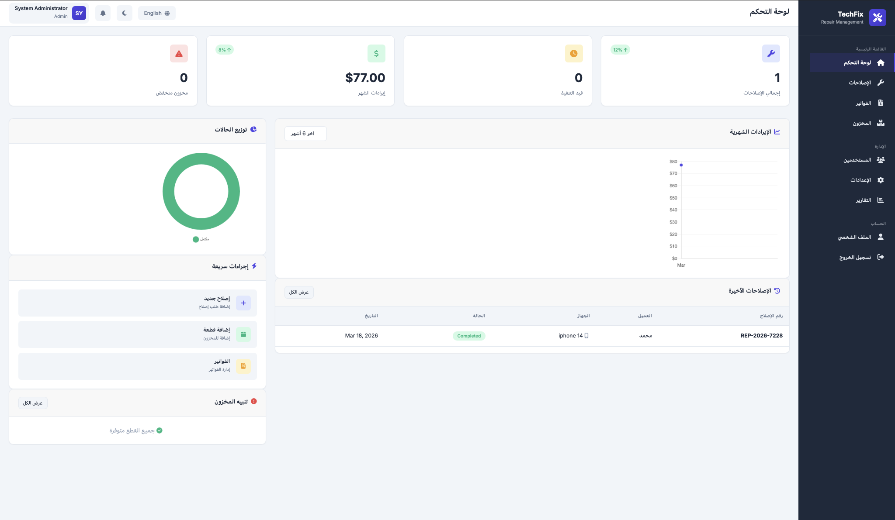
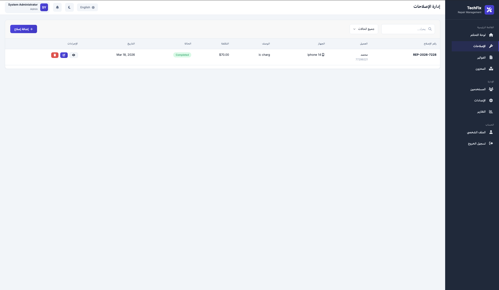
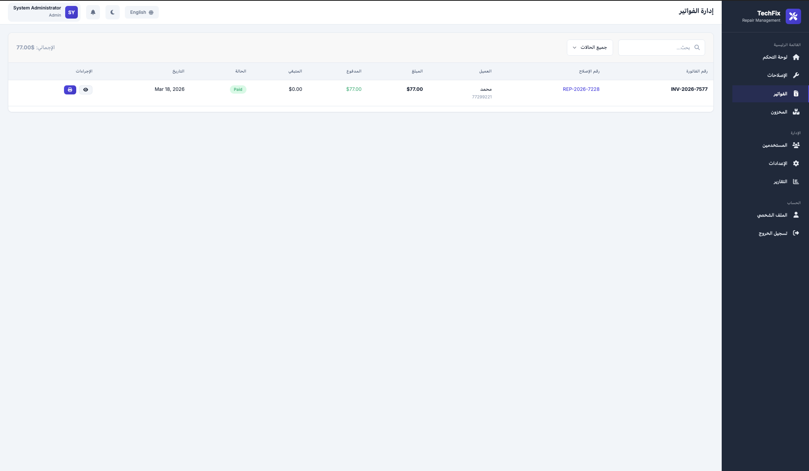
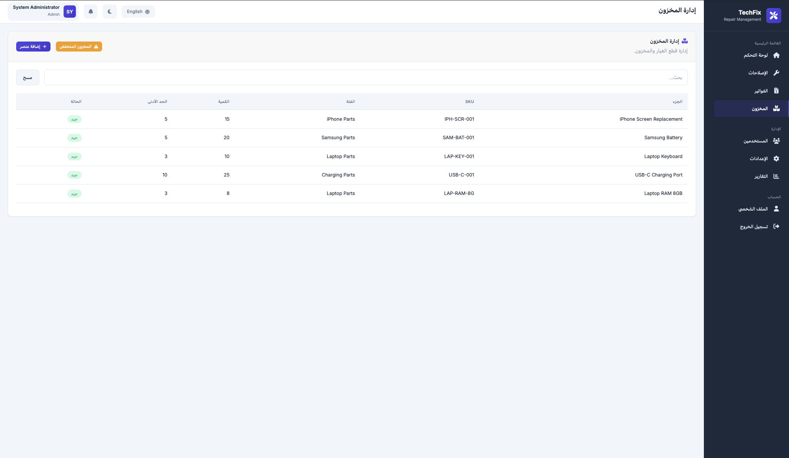
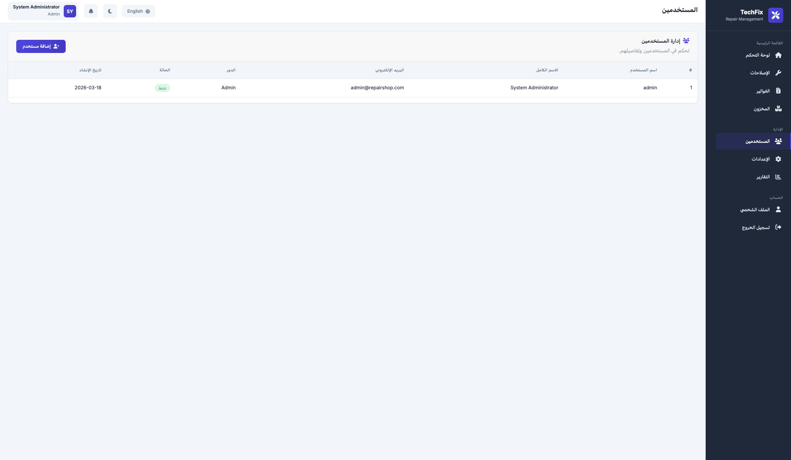
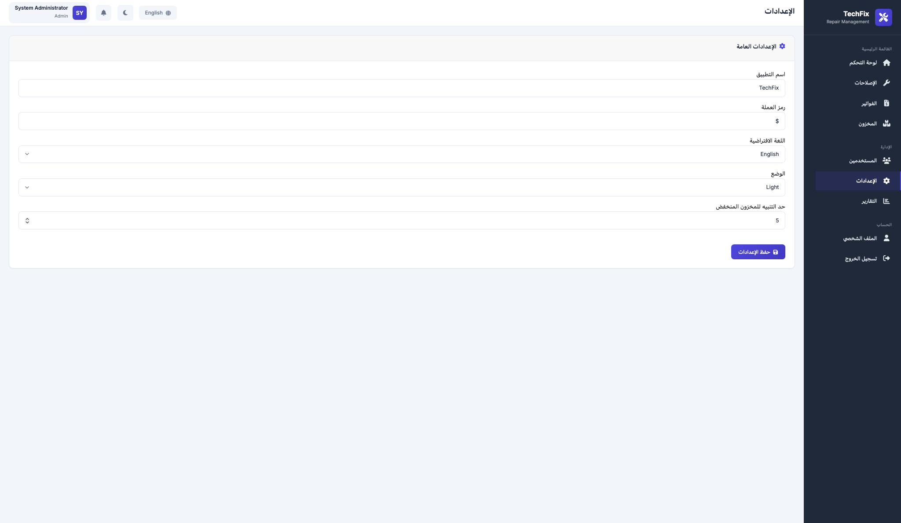
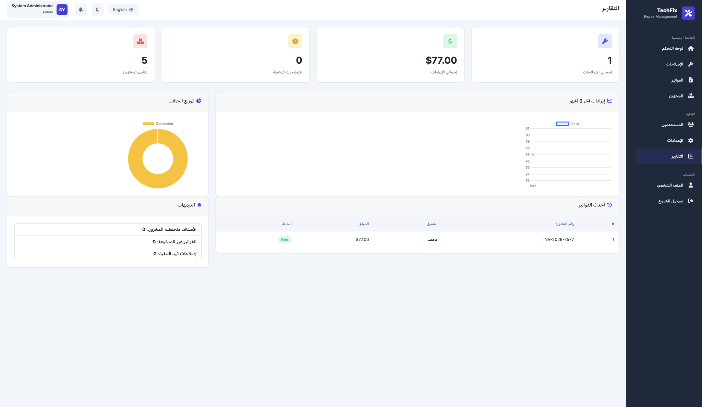
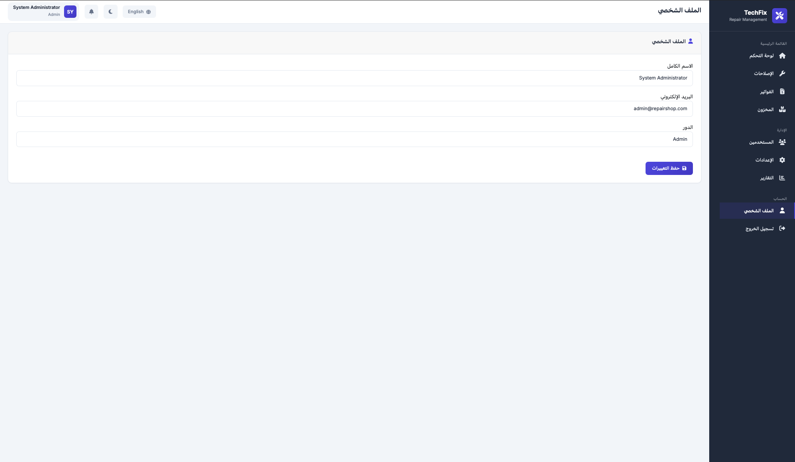

# TechFix Repair Shop (RepairShop Pro)

نظام إدارة ورشة إصلاح أجهزة مكتوب بـ PHP + MySQL + HTML/CSS/JS.

## 📌 نظرة عامة

RepairShop Pro هو نظام شامل لإدارة عمليات الورشة: طلبات الإصلاح، الفواتير، الدفعات، المخزون، التقارير، والمستخدمين.

### المميزات
- تسجيل الدخول والتسجيل
- لوحة تحكم تعرض الإحصائيات الأساسية
- إدارة إصلاحات وصيانة الأجهزة
- إدارة مخزون قطع الغيار (Low Stock Alerts)
- إدارة الفواتير مع تسجيل الدفع
- صفحة ملف شخصي
- صلاحيات مستخدم (admin/user)
- إعدادات (العنوان، العملة، اللغة، الثيم)
- تقارير رسوم بيانية
- دعم اللغة RTL (عربي / إنجليزي)

## 📁 بنية المشروع

- `index.php` — نقطة دخول (تحويل إلى dashboard أو login)
- `login.php`, `register.php`, `logout.php`
- `dashboard.php`, `repairs.php`, `invoices.php`, `inventory.php`
- `profile.php`, `users.php`, `settings.php`, `reports.php`
- `includes/header.php`, `includes/footer.php`, `includes/functions.php`
- `config/config.php`, `config/database.php`
- `assets/css/style.css`, `assets/js/main.js`
- `database/schema.sql`
- `ajax/save-preference.php`

## 🛠️ متطلبات التشغيل

1. XAMPP / MAMP / LAMP
2. PHP 8.x
3. MySQL

## 🚀 طريقة التثبيت

1. انسخ المشروع داخل مجلد السيرفر (مثلا `htdocs/repair-shop`).
2. استورد قاعدة البيانات عبر `database/schema.sql` في phpMyAdmin أو MySQL:
   - قاعدة البيانات: `repair_shop_db`
3. افتح ملف `config/config.php` وعدّل إعدادات الاتصال بـ MySQL (DB_HOST, DB_NAME, DB_USER, DB_PASS).
4. افتح المتصفح:
   - `http://localhost/repair-shop/`
5. سجّل دخول باستخدام حساب الأدمن الافتراضي (إذا استوردت `schema.sql`):
   - المستخدم: `admin`
   - البريد: `admin@repairshop.com`
   - كلمة المرور: `admin`

## 🔐 الأمان

- يستخدم `CSRF_TOKEN` لحماية الفورم.
- يستخدم دوال `sanitize(...)` لتنظيف المدخلات.
- يوجد `requireAuth()` و `requireAdmin()` لحماية الصفحات.

## 🧰 كيف تستخدم النظام

### تسجيل دخول
- اذهب إلى `login.php`، أدخل اسم المستخدم وكلمة المرور.

### لوحة التحكم
- عرض الإحصائيات: إجمالي الإصلاحات، إيرادات الشهر، عدد المخزون المنخفض.

### إدارة الإصلاحات
- أنشئ طلب أصلح جديد، حدث الحالة، عرض تفاصيل.

### إدارة الفواتير
- أنشئ فاتورة من إصلاح.
- سجل دفعات عبر زر "دفع".
- اطبع الفاتورة.

### إدارة المخزون
- أضف عنصر جديد.
- رصد المخزون المنخفض.
- بحث وعرض العناصر.

### الإدارة (Admin فقط)
- صفحتا `users.php` و `settings.php` و `reports.php` متاحة للأدمن.

## 📌 إضافة صفحة جديدة (مثال)
- أنشئ صفحة جديدة، أضف `require_once 'includes/functions.php';` ثم `requireAuth();`.
- عرّف `PAGE_TITLE` قبل هيدر.
- أضف `include 'includes/header.php';` ثم محتوى HTML ثم `include 'includes/footer.php';`.

## 💡 تطوير

- لتفعيل Dark Mode: `toggleTheme()` يستخدم `localStorage` و `saveUserPreference`.
- لتفعيل اللغة: `toggleLanguage()` تحفظ الإعداد ثم تعيد تحميل.
- يمكنك توسيع النظام بإضافة وحدة `service categories`، `purchase orders`، `notifications`.

## 🧾 المجلدات المهمة

- `includes/functions.php`: الدوال الرئيسية.
- `includes/header.php` و `includes/footer.php`: إطار الواجهة.
- `assets/select`:
  - `style.css`: أنماط CSS.
  - `main.js`: سلوك واجهة (مودال، ثيم، بحث، تأكيد، تنبيهات).

## 📌 ملاحظات

- إذا فقدت ملف، يمكنك استخدام ملفات البنية العامة لبناء مثيل جديد.
- تأكد أن `session_start()` تعمل في `config/config.php`.

---

## وصف صفحة dashboard.php

### 📌 الهدف
صفحة لوحة التحكم (dashboard.php) هي الصفحة الرئيسية بعد تسجيل الدخول، وتهدف لإعطائك نظرة سريعة على أداء الورشة في لحظة واحدة.

### 🔍 ماذا تعرض
- بطاقات إحصائيات (Stats Cards):
  - إجمالي الإصلاحات
  - الإصلاحات النشطة (قيد التنفيذ + قيد التقدم)
  - إيرادات الشهر الحالي
  - عدد العناصر منخفضة المخزون
- الرسم البياني الشهرية للإيرادات (Revenue chart)
- قائمة الإصلاحات الأخيرة (Latest repairs)
- رسم بياني لتوزيع حالة الإصلاحات (Status distribution)
- تنبيهات المخزون المنخفض
- إجراءات سريعة (Quick Actions) للوصول إلى إنشاء إصلاح جديد، إضافة عنصر مخزون، عرض الفواتير.

### 👤 التخصيص ودعم اللغة
- يعتمد على اللغة الحالية في الجلسة (`$_SESSION['language']`) لعرض النص عربي/إنجليزي.
- يستخدم `PAGE_TITLE` وملفات الهيدر/فوتر الموحدة لإظهار القالب العام.

### 🔧 المنطق الخلفي
- يجلب الإحصائيات من الدالة `getDashboardStats()` في functions.php.
- يستعلم DB عن الإصلاحات الأخيرة وقطع المخزون المنخفض.
- يحسب بيانات الرسم البياني من فواتير آخر 6 أشهر.

### ✅ لماذا مفيدة
- تعرض مؤشرات الأعمال الأساسية في شاشة واحدة.
- تساعد المدير على اكتشاف المشاكل بسرعة (مثلاً مخزون منخفض أو إصلاحات متأخرة).
- توفر روابط مباشرة للصفحات العملية لتسريع إدارة الورشة.

## وصف صفحة repairs.php

### 🎯 الهدف
هذه الصفحة هي مركز إدارة جميع طلبات الإصلاح في الورشة: إنشاء، تحديث، عرض، والبحث في سجل الإصلاحات.

### 🧭 ما تعرضه
- **قائمة الإصلاحات**: جدول بكل سجل إصلاح مع رقم الإصلاح، اسم العميل، الجهاز، الحالة، الأولوية، التواريخ، المبلغ.
- **بحث/فلتر**: يمكن البحث حسب رقم الإصلاح أو اسم العميل أو الحالة، وتصفية حسب الحالة أو الأولوية.
- **إجراءات**:
  - زر "عرض" لتفاصيل الإصلاح كامل.
  - زر "تعديل" لتحديث بيانات الإصلاح.
  - زر "طباعة" أو إنشاء فاتورة (إذا مكود بهذه الوظائف).
- **نشاط (status)**: يعرض الحالة الحالية (pending, in_progress, completed, delivered, cancelled) مع تنسيقات ألوان (badges).

### 🔧 منطق الخلفية
- يتحقق من تسجيل الدخول (`requireAuth()`).
- يقرأ معايير الاستعلام GET (search/status/priority/page).
- يبني شرط SQL ديناميكي.
- يستخدم `paginate(...)` لعرض الصفحات.
- يستخدم دوال المساعدة مثل `sanitize(...)` و `getStatusBadgeClass(...)`.
- عند الضغط على إجراء، قد ينتقل إلى `repairs.php?action=view&id=...` أو `action=edit`.

### ✅ لماذا هذه الصفحة مهمة
- هي لوحة التحكم العملية اليومية للفنيين ومدير الورشة لتتبع كل طلب إصلاح من الاستلام حتى التسليم.
- تُمكّن من رؤية الأولوية والحالة بسرعة، مما يحسن تدفق العمل ويقلل التأخير.
- يسهّل تثبيت بيانات العميل والجهاز والملاحظات في مكان واحد.

### 💡 اقتراح صغير
تستطيع إضافة زر "إضافة إصلاح جديد" واضح أعلى الصفحة، ونموذج مبسط في مودال لتسريع تسجيل التصليحات اليومية.

## وصف صفحة invoices.php

### 🎯 الهدف
صفحة الفواتير هي المكان الذي تدير منه استخدامات الدفع والفواتير من الورشة: عرض الفواتير، البحث، تحديث حالة الدفع، وطباعة الفاتورة.

### 📌 ماذا تعرض
- جدول فواتير يحتوي:
  - رقم الفاتورة
  - رقم الإصلاح المرتبط
  - اسم العميل
  - المبلغ الكلي، المبلغ المدفوع، المتبقي
  - حالة الدفع (`unpaid`, `partial`, `paid`)
  - التاريخ
- عناصر بحث/فلتر:
  - بحث نصي في رقم الفاتورة أو اسم العميل أو رقم الهاتف
  - فلتر حسب حالة الدفع
- معلومات ملخص:
  - إجمالي الفواتير، إجمالي التحصيلات
- موشن:
  - زر “عرض” لتفاصيل الفاتورة
  - زر “طباعة”
  - زر “دفع” لفتح مودال تسجيل الدفعة مع رقم الفاتورة والدفع الجديد

### 🔧 تفاصيل التشغيل
- تستدعي `GET` لقراءة `search` و `status` و `page`.
- تبني شرط SQL ديناميكي.
- تحسب pagination بالـ `paginate(...)`.
- تنشئ مودال `Record Payment` مع CSRF وحقول `amount_paid` و `payment_method`.
- عند تقديم المودال، يتم تحديث `invoices` ويحدث `payment_status` و`amount_paid` و`payment_date`.
- يظهر إشعار نجاح/خطأ ثم يعيد التوجيه إلى invoices.php.

### ✅ لماذا مفيدة
- تجمع كل عملية الفوترة في صفحة واحدة.
- تجعل المتابعة المالية والإغلاق أسهل.
- مع المودال، تحدّث الدفع بسرعة دون الخروج من شاشة الفواتير.

### 💡 تحسين صغير
أضف زر “تصدير CSV” أو “تصدير PDF” في الأعلى لتصدير الفواتير والمبالغ المالية بسرعة، خاصة لمن يحتاج تقارير محاسبية.

## وصف صفحة inventory.php

### 🎯 الهدف
صفحة المخزون تعرض وترتب إدارة قطع الغيار والمواد المتاحة في الورشة، وتسمح بإضافة أجزاء جديدة ومراقبة المخزون المنخفض.

### 📌 ماذا تحتوي
- جدول عرض عناصر المخزون:
  - اسم الجزء
  - رمز الجزء (part_code)
  - الفئة
  - الكمية المتاحة
  - الحد الأدنى
  - حالة المخزون (جيد / منخفض)
- بحث مباشر وفلتر للعرض
- زر إضافة عنصر جديد (`action=add`)
- زر عرض المخزون المنخفض
- ترقيم صفحة (pagination) عندما يزيد العدد عن الحد

### 🔧 منطق التشغيل
- يتحقق من تسجيل الدخول (`requireAuth()`).
- إذا كان `action=add` يعرض نموذج إضافة عنصر جديد، يعالج POST لإدراج (insert) في جدول `inventory`.
- في العرض الافتراضي يجلب العناصر من قاعدة البيانات مع شروط بحث وفلتر:
  - `part_name` و `part_code` و `category` بحث
  - `filter=low_stock` يعرض `quantity <= min_quantity`
- يستخدم `paginate(...)` للعرض على صفحات.
- يتم تنسيق الألوان (badges) لكل حالة مخزون.

### ✅ لماذا هذه الصفحة مفيدة
- توفر نظرة سريعة على توفر القطع.
- تنبه تلقائيًا إذا وصل الجزء للحد الأدنى.
- تسهل إضافة قطع جديدة وإدارة أسعار وتكاليف.

### 💡 اقتراح تطوير
أضف زر “تعديل” لكل صف بحيث يمكن تحديث الكمية والسعر دون الدخول لصفحة جديدة، و“سجل حركة المخزون” لعرض عمليات الإضافة والطرح لكل عنصر.

## وصف صفحة users.php

### 🎯 الهدف
الصفحة مخصصة لإدارة المستخدمين (Admin فقط) في النظام: عرض قائمة المستخدمين وحالتهم، وتوفير وصول سريع لإضافة مستخدم جديد.

### 📌 عناصر الواجهة
- جدول المستخدمين يحتوي:
  - اسم المستخدم
  - الاسم الكامل
  - البريد الإلكتروني
  - الدور (admin/user)
  - الحالة (نشط/معطل)
  - تاريخ الإنشاء
- زر “إضافة مستخدم” يذهب إلى register.php (أو نموذج إضافة داخلي).
- رسالة نجاح/خطأ (Flash messages) بعد أي عملية.
- دعم البحث/فرز بسيط حسب الحاجة.

### 🔧 منطق الخلفية
- تستدعي `requireAdmin()` للتأكد أن دخول فقط للأدمن.
- تستعلم قاعدة بيانات `users` وتحجز الأعمدة الرئيسية.
- يتم العرض بكود PHP مباشر مع لووب `foreach`.
- يمكن إضافة تحقق صلاحيات إضافي في functions.php.

### ✅ لماذا مهمة
- تتيح للأدمن التحكم في حسابات المستخدمين وإدارة الأدوار، وهو أمر أساسي للأمان والسيطرة.
- توفر رؤية سريعة للحالة التشغيلية للمستخدمين في النظام.
- تكمل الوظائف الإدارية (settings.php, reports.php) لجمع لوحة إدارة متكاملة.

## وصف صفحة settings.php

### 🎯 الهدف
صفحة الإعدادات هي لوحة التحكم الأساسية لتخصيص التطبيق (Admin) مثل اسم التطبيق، العملة، اللغة، الثيم، حد تنبيه المخزون.

### 📌 ماذا تعرض
- نموذج إعدادات عام يحتوي حقول:
  - اسم التطبيق (`app_name`)
  - رمز العملة (`currency_symbol`)
  - اللغة الافتراضية (`default_language`)
  - وضع الواجهة (`theme`: Light/Dark)
  - حد تنبيه المخزون المنخفض (`low_stock_threshold`)
- زر حفظ التغييرات
- رسالة نجاح أو خطأ بعد الحفظ

### 🔧 منطق التشغيل
- تستدعي `requireAdmin()` لحماية الوصول بالأدمن فقط.
- تقرأ الإعدادات الحالية من جدول `settings` عبر `getSetting(...)`.
- عند POST تتحقق من CSRF (`verifyCSRFToken`) ثم تقوم بتحديث القيم عبر `updateSetting(...)`.
- تحفظ في قاعدة البيانات وتعرض رسالة فلاش.

### ✅ لماذا مفيدة
- تتيح لك تغيير هوية التطبيق (اسم/عملة) دون تعديل الكود.
- تُدير تفضيلات اللغة والثيم لجميع المستخدمين.
- تضمن مراقبة المخزون المنخفض بإعداد حد قابل للتعديل.

## وصف صفحة reports.php

### 🎯 الهدف
صفحة التقارير تقدم نظرة تحليلية لبيانات الورشة؛ الإيرادات، توزيع حالات الإصلاح، والتنبيهات التشغيلية في واجهة مركزية.

### 📌 ماذا تعرض
- بطاقات KPI: إجمالي الإصلاحات، إجمالي الإيرادات، الإصلاحات النشطة، إجمالي المخزون.
- رسم بياني للإيرادات لآخر 6 أشهر.
- رسم بياني دائري لتوزيع حالات الإصلاح (pending, in_progress, completed...).
- جدول الفواتير الحديثة أو الملخص المالي السريع.
- تنبيهات سريعة: عدد العناصر منخفضة المخزون، الفواتير غير المدفوعة، الإصلاحات قيد التنفيذ.

### 🔧 منطق التشغيل
- تستدعي `requireAdmin()` لحماية الصفحة للأدمن.
- تجلب الإحصائيات من دوال مثل `getDashboardStats()` وطلبات SQL لتقرير الإيرادات.
- تعالج البيانات لتخبر Chart.js عن التسميات والنقاط.
- تعرض النتائج في بطاقات وكروت جاهزة.

### ✅ لماذا مهمة
- تمنح المسؤول “صورة عامة” عن الأداء التجاري بسرعة.
- تساعد في اتخاذ قرارات (تركيز على المبيعات، مراقبة المخزون، تحسين وقت الإصلاح).
- يمكن توسعها لاحقاً بإضافة تقارير دورية (يومي، أسبوعي، سنوي) وتحليل الربحية.

## وصف صفحة profile.php

### 🎯 الهدف
صفحة الملف الشخصي تسمح للمستخدم بالاطلاع على بياناته الشخصية وتحديثها (الاسم، البريد) بشكل آمن.

### 📌 ماذا تعرض
- نموذج يحتوي:
  - الاسم الكامل
  - البريد الإلكتروني
  - الدور (قراءة فقط)
- زر حفظ للتحديث.
- رسائل فلاش للنجاح أو الخطأ بعد حفظ التغييرات.

### 🔧 منطق التشغيل
- تستدعي `requireAuth()` لضمان الدخول.
- تجلب المستخدم الحالي من `getCurrentUser()`.
- عند POST:
  - تتحقق من `csrf_token`.
  - تتأكد من أن البيانات صالحة (`full_name` غير فارغ، email صالح).
  - تحدث بيانات المستخدم في جدول `users`.
  - تعرض رسالة نجاح ثم تعيد تحميل.
- تستخدم `sanitize(...)` لتجنب XSS.

### ✅ لماذا مهمة
- تتيح للمستخدم التحكم في بياناته الأساسية.
- تبقي معلومات الحساب محدثة.
- تعمل كقاعدة لتوسعة لاحقة (مثلاً تغيير كلمة المرور، صورة ملف شخصي، إعدادات حساب).

